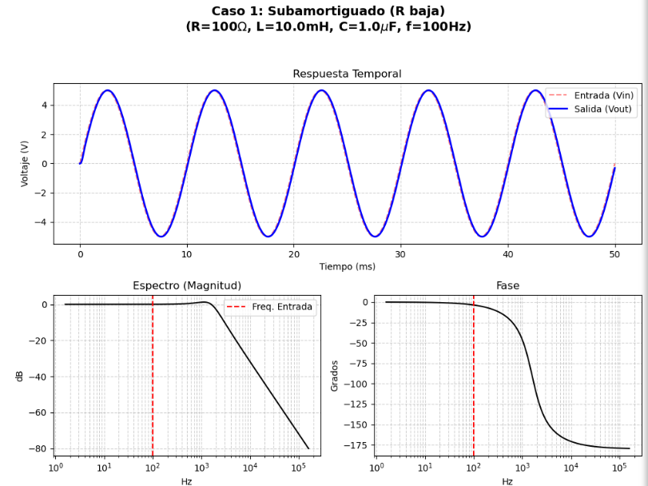
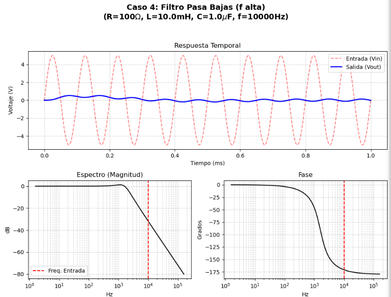

  
   <h1> Simulación y Análisis de Circuito RLC Serie</h1>
  <h3>Análisis de Señales y Sistemas de Comunicación | Ingeniería en TICS</h3>

  

    
    
    
     
    
    
    
  

---

##  Descripción del Proyecto

Este proyecto desarrolla una **simulación computacional interactiva** de un circuito RLC en serie, modelado como un sistema lineal de segundo orden.

El objetivo es cerrar la brecha entre la teoría matemática (ecuaciones diferenciales y transformada de Laplace) y la realidad física, permitiendo visualizar cómo los cambios en componentes comerciales ($R, L, C$) afectan drásticamente el comportamiento del sistema en el tiempo y la frecuencia.

###  Características Principales
*  **Modelado Matemático:** Implementación de la Función de Transferencia $H(s)$.
*  **Análisis Temporal:** Visualización de la respuesta al escalón/senoidal (oscilaciones, amortiguamiento).
* Em **Análisis Frecuencial:** Generación automática de diagramas de Bode (Magnitud y Fase).
*  **Automatización:** Script optimizado para generar múltiples casos de estudio con una sola ejecución.

---

##  Tecnologías y Herramientas

Este proyecto fue construido utilizando el ecosistema científico de Python.

| Tecnología | Propósito en el proyecto |
| :--- | :--- |
|  **Python** | Lenguaje núcleo para la lógica de simulación. |
|  **Jupyter** | Entorno interactivo para documentar código, texto y resultados. |
|  **NumPy** | Manejo eficiente de arrays y cálculos numéricos (vectores de tiempo y frecuencia). |
|  **SciPy (Signal)** | El motor del proyecto: define las funciones de transferencia (`lti`), simula en el tiempo (`lsim`) y calcula Bode (`bode`). |
|  **Matplotlib** | Generación de las gráficas profesionales de tiempo, espectro y fase. |

---

##  Galería de Resultados

A continuación se presentan algunos de los casos de estudio analizados en el notebook.

| **Caso 1: Subamortiguado (Oscilatorio)** | **Caso 3: Resonancia (Pico Máximo)** |
| :---: | :---: |
|  |  |
| *Se observa la oscilación inicial debido a una resistencia baja ($100\Omega$).* | *La frecuencia de entrada coincide con la natural, generando máxima amplificación.* |

| **Caso 4: Filtro Pasa-Bajas** |
| :---: |
|  |
| *A alta frecuencia ($10kHz$), el capacitor atenúa casi por completo la señal de entrada.* |

---

##  Información Académica

| Rubro | Detalle |
| :--- | :--- |
| **Institución** | ITESS |
| **Carrera** | Ingeniería en Tecnologías de la Información y Comunicaciones |
| **Materia** | Análisis de Señales y Sistemas de Comunicación |
| **Alumno** | **Jesús López Silva** |
| **Fecha** | Diciembre 2025 |

---
